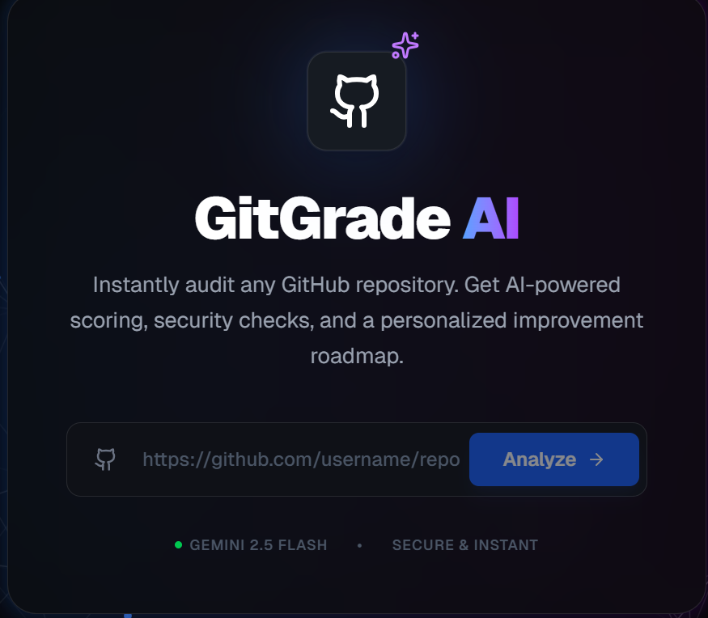
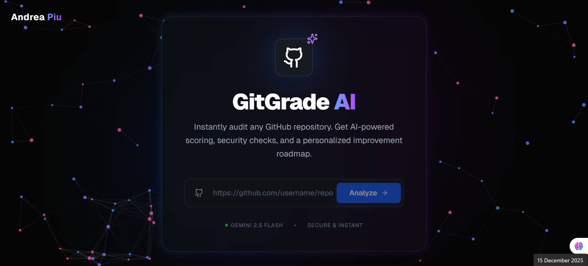
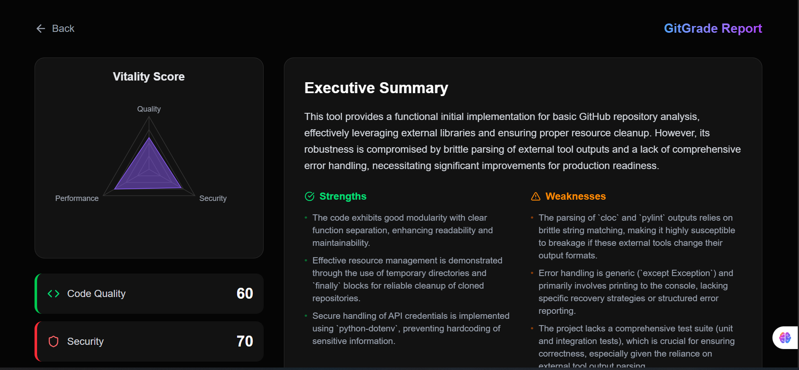
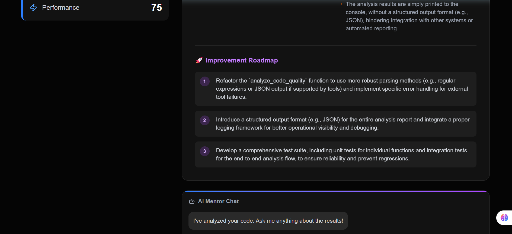

# 🔮 GitGrade AI



**Your personal AI Code Auditor.** Instantly analyze any public GitHub repository to get a 360° evaluation of code quality, security posture, and performance—powered by Google's Gemini 2.5 Flash.

🔗 **[Live Demo](https://gitgrade-vq3d.vercel.app)** · 🐛 **[Report Bug](https://github.com/ChosenOne6969/gitgrade/issues)**

---

##  Overview

**GitGrade AI** transforms the code review process. Instead of waiting days for a human review, developers can get instant, actionable feedback. The application uses advanced LLMs to parse repository structures, identify "code smells," detect hardcoded secrets, and generate a personalized roadmap for improvement.

It features a stunning, interactive **Glassmorphic UI** with particle effects, ensuring the experience is as beautiful as it is functional.

## ✨ Key Features

* **⚡ Instant Grading:** powered by **Gemini 2.5 Flash** for sub-second analysis.
* **📊 Visual Analytics:** Interactive Radar Charts (Recharts) visualizing Code Quality vs. Security vs. Performance.
* **🛡️ Security Scans:** Auto-detection of hardcoded secrets, API keys, and vulnerabilities.
* **🤖 AI Mentor Chat:** A context-aware chat interface to ask follow-up questions about the analysis.
* **🎨 Immersive UI:** Dark mode aesthetic with `tsparticles` interactive backgrounds and glassmorphism.

---

## 🛠️ Tech Stack

* **Core:** [Next.js 14](https://nextjs.org/) (App Router), [React](https://react.dev/), [TypeScript](https://www.typescriptlang.org/)
* **AI Model:** [Google Gemini API](https://ai.google.dev/) (`gemini-2.5-flash`)
* **Styling:** [Tailwind CSS](https://tailwindcss.com/), [Lucide Icons](https://lucide.dev/)
* **Visualization:** [Recharts](https://recharts.org/)
* **Effects:** [TSParticles](https://particles.js.org/)
* **Deployment:** [Vercel](https://vercel.com/)

---

## 📸 Screenshots

| Landing Page | Analysis Dashboard |
|:---:|:---:|
|  |  |  |

---

## 🏃‍♂️ Getting Started Locally

Follow these steps to set up the project locally on your machine.

### Prerequisites

* Node.js (v18 or higher)
* npm or yarn
* A Google Gemini API Key

### Installation

1.  **Clone the repository**
    ```bash
    git clone [https://github.com/ChosenOne6969/gitgrade.git](https://github.com/ChosenOne6969/gitgrade.git)
    cd gitgrade
    ```

2.  **Install dependencies**
    ```bash
    npm install
    ```

3.  **Set up Environment Variables**
    Create a `.env.local` file in the root directory and add your API key:
    ```env
    GEMINI_API_KEY=your_actual_api_key_here
    ```

4.  **Run the development server**
    ```bash
    npm run dev
    ```

5.  **Open your browser**
    Navigate to `http://localhost:3000` to see the app running.

---

## 🤝 Contributing

Contributions are always welcome!

1.  Fork the project
2.  Create your Feature Branch (`git checkout -b feature/AmazingFeature`)
3.  Commit your changes (`git commit -m 'Add some AmazingFeature'`)
4.  Push to the Branch (`git push origin feature/AmazingFeature`)
5.  Open a Pull Request

---

## 📄 License

Distributed under the MIT License. See `LICENSE` for more information.

---

## 👨‍💻 Created By

**Andrea PIiu** *Full Stack Developer & AI Enthusiast*

[](https://github.com/ChosenOne6969)